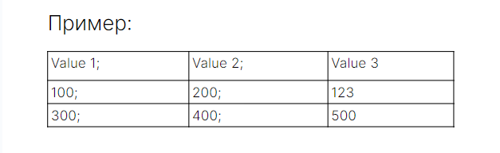

                Lesson_6
            Практическое задание

1. Реализовать сохранение данных в csv файл;
2. Реализовать загрузку данных из csv файла. Файл читается целиком. 

Структура csv файла: 
- строка заголовок с набором столбцов;
- набор строк с целочисленными значениями;
- разделитель между столбцами - символ точка с запятой (;).

(Пример см. на скриншоте)

Для хранения данных использовать класс вида: 
public class AppData { 

   private String[] header; 
   private int[][] data; 
   // ...
   
} 
Если выполняется save(AppData data), то старые данные в файле полностью перезаписываются.

