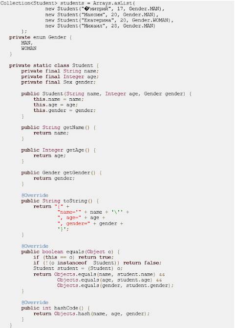

                Lesson_6
            Практическое задание

Реализовать сохранение данных в csv файл; Реализовать загрузку данных из csv файла. Файл читается целиком. 

Структура csv файла: 
Строка заголовок с набором столбцов 
Набор строк с целочисленными значениями 
Разделитель между столбцами - символ точка с запятой (;)

(Пример см. на скриншоте)

Для хранения данных использовать класс вида: 
public class AppData { 
   private String[] header; 
   private int[][] data; 
   // ...
} 
Если выполняется save(AppData data), то старые данные в файле полностью перезаписываются.
